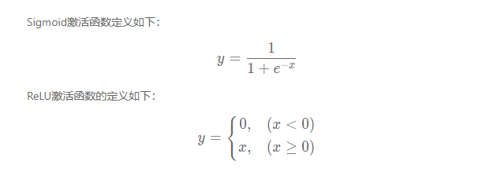

```#计算机视觉模型
#https://www.paddlepaddle.org.cn/tutorials/projectdetail/2250773#anchor-2
#卷积神经网络
#涉及：卷积、池化、激活函数、批归一化、丢弃法等

#两个典型任务：图像分类  目标检测
#图像分类典型模型结构：LeNet、AlexNet、VGG
#目标检测典型模型结构：YOLOv3

#在计算机时间子任务图鉴中，包含了以下四类任务
#1.图像分类
#2.目标检测
#3.语义分割
#4.实例分割

#为何要使用卷积：
#1.一维向量会丢失数据的空间信息
#2.模型参数过多，容易产生过拟合
#为了解决上述问题，引入卷积神经网络进行特征提取，既能提取到相邻像素点之间的特征模式，又能保证参数的个数不随图片尺寸变化
#在卷积神经网络中，计算范围是在像素点的空间邻域内进行的，卷积核参数的数目也远小于全连接层。
# 卷积核本身与输入图片大小无关，它代表了对空间邻域内某种特征模式的提取。比如，有些卷积核提取
# 物体边缘特征，有些卷积核提取物体拐角处的特征，图像上不同区域共享同一个卷积核。当输入图片
# 大小不一样时，仍然可以使用同一个卷积核进行操作。

#感受野
#3×3卷积对应的感受野大小就是3×3，当通过两层3×3的卷积之后，感受野的大小将会增加到5×5
#因此，当增加卷积网络深度的同时，感受野将会增大，输出特征图中的一个像素点将会包含更多的图像语义信息。

#多输入通道、多输出通道和批量操作
#前面介绍的卷积计算过程比较简单，实际应用时，处理的问题要复杂的多。
# 例如：对于彩色图片有RGB三个通道，需要处理多输入通道的场景。
# 输出特征图往往也会具有多个通道，而且在神经网络的计算中常常是把一个批次的样本放在一起计算，
# 所以卷积算子需要具有批量处理多输入和多输出通道数据的功能，下面将分别介绍这几种场景的操作方式。

#多输入通道：
#多输出通道：通常将卷积核的输出通道数叫做卷积核的个数。
#批量操作：在卷积神经网络的计算中，通常将多个样本放在一起形成一个mini-batch进行批量操作，即输入数据的维度

#飞桨API  paddle.nn.Conv2D(in_channels,out_channels,kernel_size,stride,padding)
#in_channles:输入数据通道数
#out_channels：卷积核个数

#卷积核  ：（卷积核个数，卷积核通道数，H,W）

#简单的图像黑白边界检测
import matplotlib.pyplot as plt
import numpy as np
import paddle
from paddle.nn import Conv2D
from paddle.nn.initializer import Assign
#%matplotlib inline

# 创建初始化权重参数w
w = np.array([1, 0, -1], dtype='float32')
# 将权重参数调整成维度为[cout, cin, kh, kw]的四维张量
w = w.reshape([1, 1, 1, 3])
# 创建卷积算子，设置输出通道数，卷积核大小，和初始化权重参数
# kernel_size = [1, 3]表示kh = 1, kw=3
# 创建卷积算子的时候，通过参数属性weight_attr指定参数初始化方式
# 这里的初始化方式时，从numpy.ndarray初始化卷积参数
conv = Conv2D(in_channels=1, out_channels=1, kernel_size=[1, 3],
       weight_attr=paddle.ParamAttr(
          initializer=Assign(value=w)))

# 创建输入图片，图片左边的像素点取值为1，右边的像素点取值为0
img = np.ones([50,50], dtype='float32')
img[:, 30:] = 0.
# 将图片形状调整为[N, C, H, W]的形式
x = img.reshape([1,1,50,50])
# 将numpy.ndarray转化成paddle中的tensor
x = paddle.to_tensor(x)
# 使用卷积算子作用在输入图片上
y = conv(x)
# 将输出tensor转化为numpy.ndarray
out = y.numpy()
print(out.shape)
f = plt.subplot(121)
f.set_title('input image', fontsize=15)
plt.imshow(img, cmap='gray')
f = plt.subplot(122)
f.set_title('output featuremap', fontsize=15)
# 卷积算子Conv2D输出数据形状为[N, C, H, W]形式
# 此处N, C=1，输出数据形状为[1, 1, H, W]，是4维数组
# 但是画图函数plt.imshow画灰度图时，只接受2维数组
# 通过numpy.squeeze函数将大小为1的维度消除
plt.imshow(out.squeeze(), cmap='gray')
plt.show()
print(conv.weight,conv.bias)

#检测图片中的边缘
import matplotlib.pyplot as plt
from PIL import Image
import numpy as np
import paddle
from paddle.nn import Conv2D
from paddle.nn.initializer import Assign
img = Image.open('./1.png')

# 设置卷积核参数
w = np.array([[-1,-1,-1], [-1,8,-1], [-1,-1,-1]], dtype='float32')/8
w = w.reshape([1, 1, 3, 3])
# 由于输入通道数是3，将卷积核的形状从[1,1,3,3]调整为[1,3,3,3]
w = np.repeat(w, 3, axis=1)
# 创建卷积算子，输出通道数为1，卷积核大小为3x3，
# 并使用上面的设置好的数值作为卷积核权重的初始化参数
conv = Conv2D(in_channels=3, out_channels=1, kernel_size=[3, 3], 
            weight_attr=paddle.ParamAttr(
              initializer=Assign(value=w)))
    
# 将读入的图片转化为float32类型的numpy.ndarray
x = np.array(img).astype('float32')
# 图片读入成ndarry时，形状是[H, W, 3]，
# 将通道这一维度调整到最前面
x = np.transpose(x, (2,0,1))
# 将数据形状调整为[N, C, H, W]格式
x = x.reshape(1, 3, img.height, img.width)
x = paddle.to_tensor(x)
y = conv(x)
out = y.numpy()
plt.figure(figsize=(20, 10))
f = plt.subplot(121)
f.set_title('input image', fontsize=15)
plt.imshow(img)
f = plt.subplot(122)
f.set_title('output feature map', fontsize=15)
plt.imshow(out.squeeze(), cmap='gray')
plt.show()

print(conv.weight,conv.bias)


#图像均值模糊
import paddle
import matplotlib.pyplot as plt
from PIL import Image
import numpy as np
from paddle.nn import Conv2D
from paddle.nn.initializer import Assign
# 读入图片并转成numpy.ndarray
# 换成灰度图
img = Image.open('./1.png').convert('L')
img = np.array(img)

# 创建初始化参数
w = np.ones([1, 1, 5, 5], dtype = 'float32')/25
conv = Conv2D(in_channels=1, out_channels=1, kernel_size=[5, 5], 
        weight_attr=paddle.ParamAttr(
         initializer=Assign(value=w)))
x = img.astype('float32')
x = x.reshape(1,1,img.shape[0], img.shape[1])
x = paddle.to_tensor(x)
y = conv(x)
out = y.numpy()

plt.figure(figsize=(20, 12))
f = plt.subplot(121)
f.set_title('input image')
plt.imshow(img, cmap='gray')

f = plt.subplot(122)
f.set_title('output feature map')
out = out.squeeze()
plt.imshow(out, cmap='gray')

plt.show()


#池化
#池化是使用某一位置的相邻输出的总体统计特征代替网络在该位置的输出，其好处是当输入数据做出少量平移时，
# 经过池化函数后的大多数输出还能保持不变。比如：当识别一张图像是否是人脸时，我们需要知道人脸左边有
# 一只眼睛，右边也有一只眼睛，而不需要知道眼睛的精确位置，这时候通过池化某一片区域的像素点来得到
# 总体统计特征会显得很有用。由于池化之后特征图会变得更小，如果后面连接的是全连接层，能有效的减小神经元
# 的个数，节省存储空间并提高计算效率。
#池化分为平均池化和最大池化


#ReLU激活函数
#前面介绍的网络结构中，普遍使用Sigmoid函数做激活函数。在神经网络发展的早期，Sigmoid函数用的比较多，
# 而目前用的较多的激活函数是ReLU。这是因为Sigmoid函数在反向传播过程中，容易造成梯度的衰减,可以通过下列
#公式看出

#梯度消失现象
# 在神经网络里，将经过反向传播之后，梯度值衰减到接近于零的现象称作梯度消失现象。
# 从上面的函数曲线可以看出，当xxx为较大的正数的时候，Sigmoid函数数值非常接近于1，
# 函数曲线变得很平滑，在这些区域Sigmoid函数的导数接近于零。当xxx为较小的负数时，
# Sigmoid函数值也非常接近于0，函数曲线也很平滑，在这些区域Sigmoid函数的导数也接近于0。
# 只有当xxx的取值在0附近时，Sigmoid函数的导数才比较大。对sigmoid函数求导，结果如下：


```


